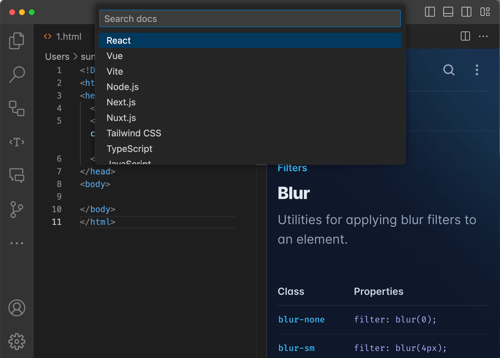

# Docs Finder
Easily find any docs you need. React, Vue, Tailwind ...

## Features
- Open with shortcut `Ctrl+Shift+K` or `Cmd+Shift+K`
- Or right click on the editor and select `Docs Finder...`
- If select some words then trigger, it will search the selected words

## Configuration
Documents will open in VS Code by default. 
You can change the setting "Docs Finder: Viewer Type" to use system's web browser.

*Some documents do not allow opening in an iframe, so the system's browser will be used instead.*